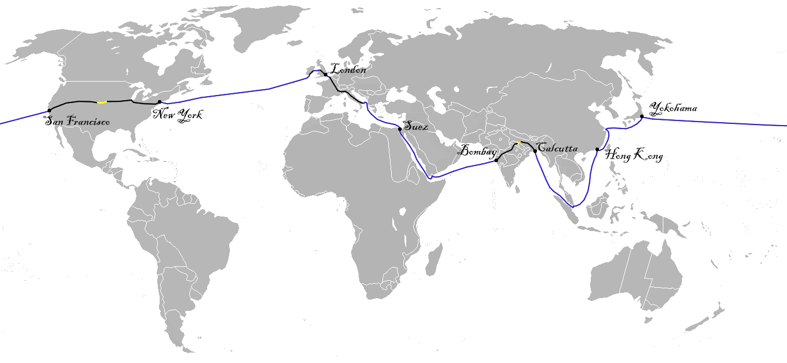

# Jules Verne Testcorpus

Since the goal of this project was to create a workflow to **access the spatial footprint of a text**, we used the novel "Around the World in Eighty Days" (*ger.: "In 80 Tagen um die Welt"*) by Jules Verne (1873) to develop and test different approaches.

We chose this text for the following reasons:

+ high quality of fulltext: manually transcribed instead of OCR
+ publication date roughly similar to travelogues corpus: similar speech patterns (NER)
+ available in german: same language
+ well-known text: easy to establish ground truth

Download link for the text version used here: https://archive.org/stream/JulesVerneReiseumdieErdein80Tagen/JulesVerne-ReiseumdieErdein80Tagen_djvu.txt (05.12.2022).

## Applied Workflow:

+ [src/ner_jules_verne.py](src/ner_jules_verne.py) applied to [data/jules_verne_80_days_de_archive.txt](data/jules_verne_80_days_de_archive.txt)
+ [src/ner_jules_verne.py](src/ner_jules_verne.py) function ```dummy_save_to_outfile``` creates [data/jules_verne_80_days_de_archive_ner_results.txt](data/jules_verne_80_days_de_archive_ner_results.txt) as a rough insight into the NER result per sentence
+ [src/ner_jules_verne.py](src/ner_jules_verne.py) creates [data/jules_verne_80_days_de_archive.json](data/jules_verne_80_days_de_archive.json)
+ JSON file contains recognizes locations in the following structure:

```
        {
            "type": "Feature",
            "properties": {
                "source_label": "London",
                "sentence_idx": 48,
                "start_position": 66,
                "end_position": 72,
                "url": "https://www.geonames.org/2643743"
            },
            "geometry": {
                "type": "Point",
                "coordinates": [
                    "-72.1065",
                    "41.46678"
                ]
            }
        },
````
+ Manual Postprocessing according to [travelogues/README.md#manual-post-correction-for-geojson-files](reiseberichte_kartiert/travelogues/README.md#manual-post-correction-for-geojson-files)
+ [src/jules_verne_pattern_correction.py](src/jules_verne_pattern_correction.py) applied to [data/jules_verne_80_days_de_archive.json](data/jules_verne_80_days_de_archive.json)
+ [data/jules_verne_80_days_metadata](data/jules_verne_80_days_metadata) created manually

## Further Processing

The idea was to use [DBSCAN Clustering](reiseberichte_kartriert/Clusteranalyse/README.md) to replicate the following image, extrapolated from the given data:



