# Subproject "Travelogues"

## The workflow
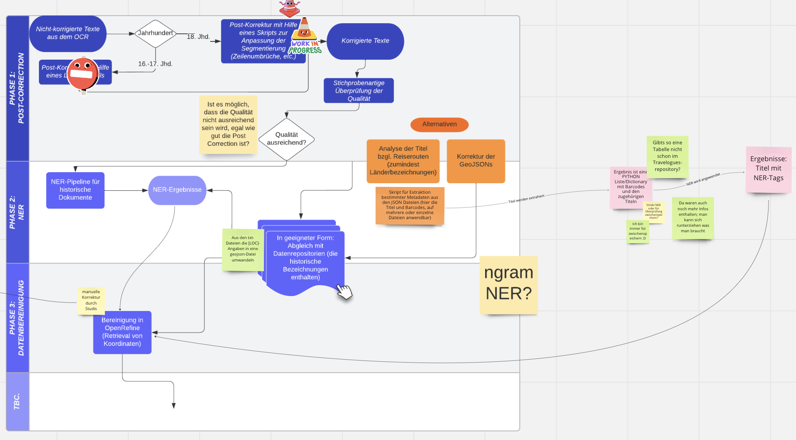

## Scripts and modules


### Post-correction of (GEO)JSON files

In order to get the best results, we decided it would be beneficial to manually correct the JSON files
that contain the NER results for the travelogues. To do this in a relatively fast manner, we
created a pipeline which adds the missing URLs of the GeoNames features to the files. Since the API has a small rate limiti
(only 1000 credits per hour), a lot still has to be done a hundred percent manually.

The location results have to be corrected because the original travelogues, written in non-standardised German from the 18th century,
contain many errors. However, the NER model still managed to find a lot of entities from the noisy OCR. These instances contain
spelling errors that need to be corrected before trying to find their match on GeoNames and especially
before being displayed on our map. Additionally, historical locations were often not correctly recognised – their URLs and coordinates
need to be corrected.

The [format](https://en.wikipedia.org/wiki/GeoJSON) for the GeoJSONs.
An extended example file can be found [here](./data/output/text_ner/with_url/Z11480080X.json).
```
{
    "type": "FeatureCollection",
    "features": [
        {
            "type": "Feature",
            "properties": {
                "source_label": "arabien",
                "sentence_idx": 5,
                "start_position": 35,
                "end_position": 42,
                "url": "https://www.geonames.org/102358"
            },
            "geometry": {
                "type": "Point",
                "coordinates": [
                    "45",
                    "25"
                ]
            }
        },
        {
            "type": "Feature",
            "properties": {
                "source_label": "arabien",
                "sentence_idx": 13,
                "start_position": 133,
                "end_position": 140,
                "url": "https://www.geonames.org/102358"
            },
            "geometry": {
                "type": "Point",
                "coordinates": [
                    "45",
                    "25"
                ]
            }
        },
        {
            "type": "Feature",
            "properties": {
                "source_label": "haleb",
                "sentence_idx": 14,
                "start_position": 135,
                "end_position": 140,
                "url": "https://www.geonames.org/170063"
            },
            "geometry": {
                "type": "Point",
                "coordinates": [
                    "37.16117",
                    "36.20124"
                ]
            }
        },
        {
            "type": "Feature",
            "properties": {
                "source_label": "\u00a4",
                "sentence_idx": 15,
                "start_position": 77,
                "end_position": 78,
                "url": "https://www.geonames.org/None"
            },
            "geometry": {
                "type": "Point",
                "coordinates": [
                    null,
                    null
                ]
            }
        }
    ]
}
```

## Manual Post-Correction for (GEO)JSON files

### Step 1

- Edda: Z103519403
- Jan-Philipp: Z103519506
- Lisa: Z103519609
- Sarah: Z103561602, Z114800707, Z11480080X 
- Solange: Z114799006
- Svenja: Z114801803
- Tatiana: Z69804407

Check, if your file already has **geonames-URLs** attached:

Is your file stored in reiseberichte-kartriert/travelogues/data/output/text_ner/? --> No geonames-URLs.

Is your file stored in reiseberichte-kartriert/travelogues/data/output/text_ner/**with_url/**? --> With geonames-URLs. Proceed to Step 2.

### Step 1b: automatically add geonames-URL to file

If your file only has **dummy geonames-URLs**, it looks like this: 

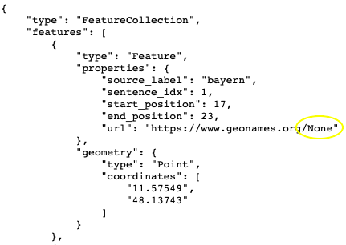

This dummy URL has been created with simple Textprocessing. It is possible to manually change ```None```to the correct identifyer (e. g. ```2618425```) in Step 2, but let's try the computational solution first. It is less error-prone and (in theory) faster.

**The goal is for your file to look like this:**

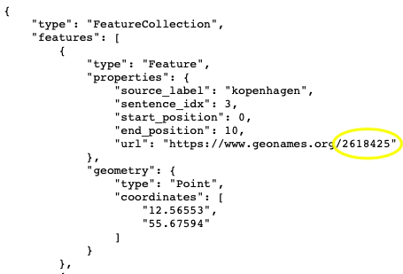

Try using Sarahs pipeline ```add_info_to_JSON.ipynb``` (https://github.com/kartriert/reiseberichte-kartriert/blob/d447fa9920acb9e5411de6d01a28e5f3e1f36ba6/travelogues/src/add_info_to_JSON.ipynb) to replace the dummy URLs with geonames-URLs. 

### Step 2: Check, if the correct location was matched to the keyword

For each element of the list features, you need to check and possibly correct 3 chunks of information:

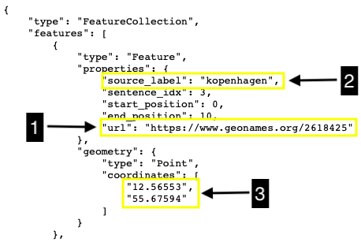

1.  Copy the url into your browser. 
    
    Quick check on the map: **Does this placement make any sense in the context of the historical source material?**
    
    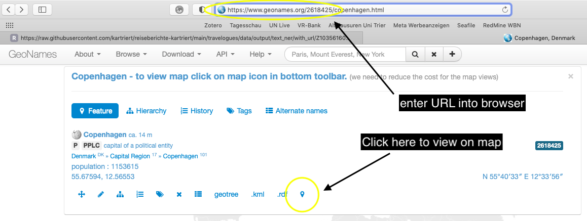
    
    If yes: Great! --> Next element.
    
2.  If there still is a dummy-URl, enter the ```source_label```into https://www.geonames.org search bar.

    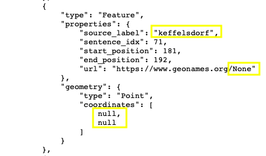
    
    Are there multiple alternatives with this name? Is one immediately the most logical choice?
    
    If yes: Great! --> Next step.
    
    Are there no matches in Geonames? 
    
    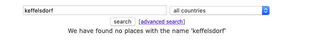
    
    Try a quick web search: Did the OCR not work porperly? Meaning, **is the keyword (```source_label```) correct?**
    
    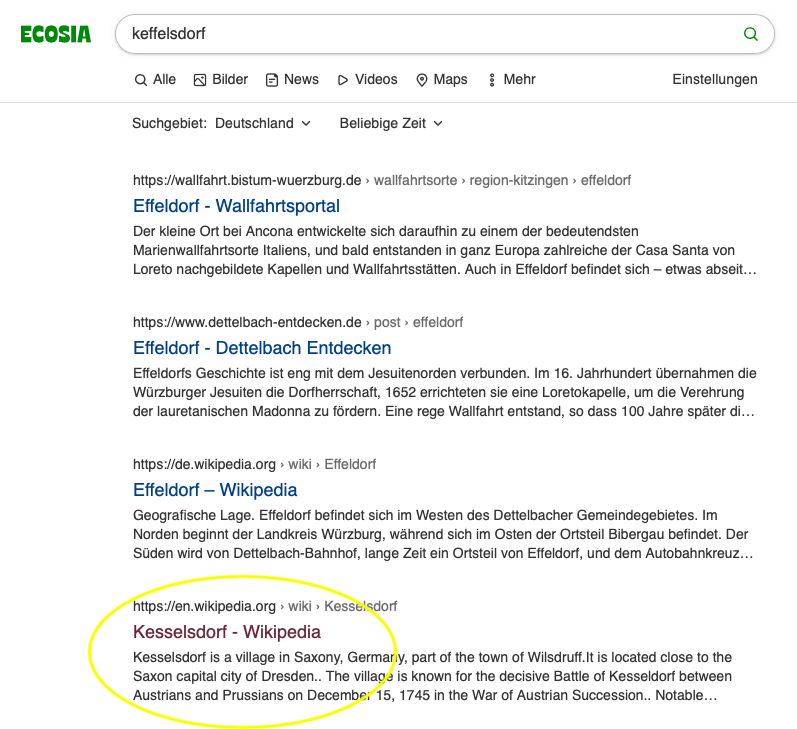
    
    If you find a solution (here: ss was turned into ff during OCR), try it in Geonames again.
    
    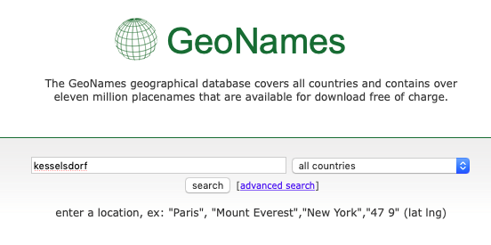
    
    If you found a solution that isn't listed in Geonames, try to find a permalink from another Database that you can enter in the url-property (i. e. Wikidata).
    
    **And remember, we are only trying to opimize the results. It will not be possible to deduce every location without the full textual context.**
    
### Step 3: Correct feature information in the .json file
 
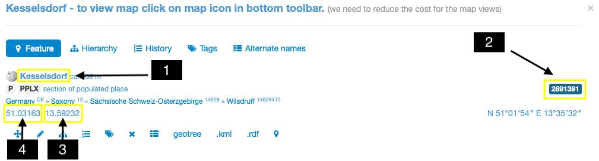

Here, we enter the correct information into the file.

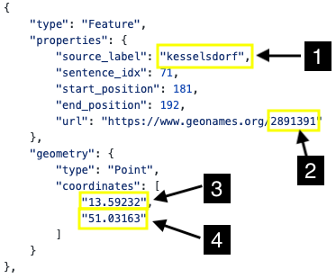

Make sure you only change the characters that you need to.

Make sure that you use quotes (```""```) in the coordinates.

Make sure, you put the East-Coordinate before the North-Coordinate in the .json feature.

### Step 4: Data management

You can edit the .json file online:

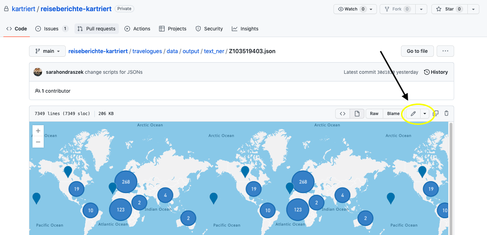

After you finished your editing session, remember to add an extended description, so that both you and the group can see the progress that was made and is always up to date:

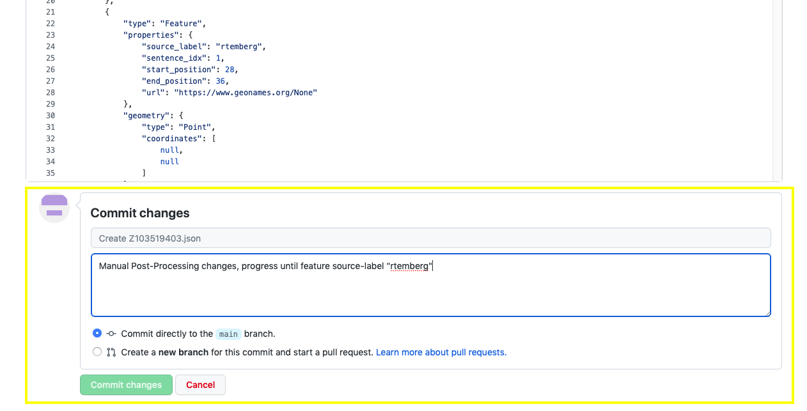

If you choose to download your file, work in your forked repository or whatever, make sure that you reupload/push your corrected file at the same place with the same name so that the version control system of Github can log the changes and process made.
    
## Results
